# 10. Business Workflows

---

# 1. Introduction

Business workflows describe the sequence of activities performed by users and the system to achieve business objectives. These workflows ensure consistent execution of recruitment processes, improve collaboration between stakeholders, and provide a clear understanding of how KrewOps supports the complete hiring lifecycle.

The workflows documented in this chapter represent the logical business processes independent of technical implementation.

---

# 2. End-to-End Recruitment Workflow

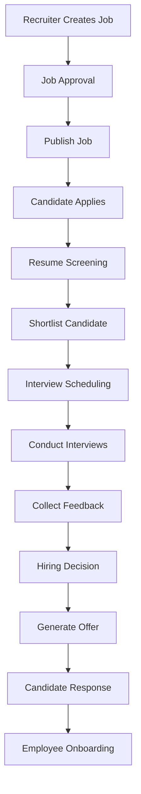

---

# 3. Job Creation Workflow

## Objective

Create and publish an approved job opening.

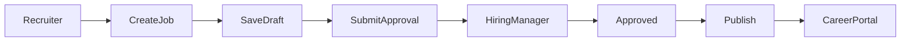

### Actors

- Recruiter
- Hiring Manager
- HR Administrator

### Outcome

Approved job becomes available for applications.

---

# 4. Candidate Application Workflow

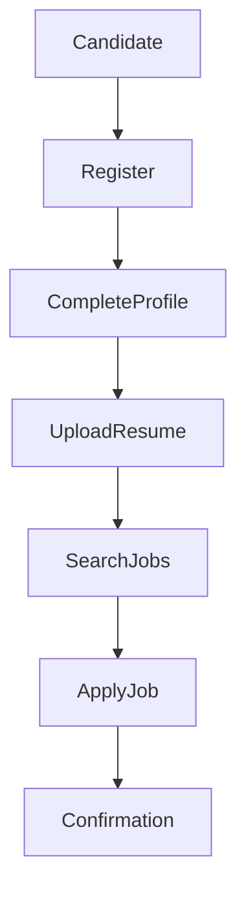

### Outcome

Application enters recruitment pipeline.

---

# 5. Resume Screening Workflow

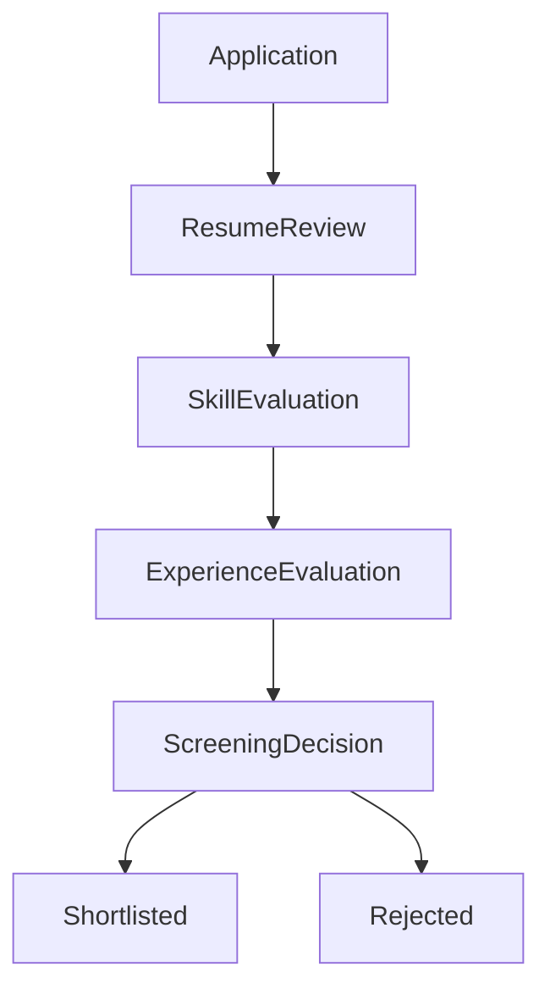

### Business Rules

- Duplicate applications prevented
- Mandatory qualifications validated
- Recruiter comments recorded

---

# 6. Interview Scheduling Workflow

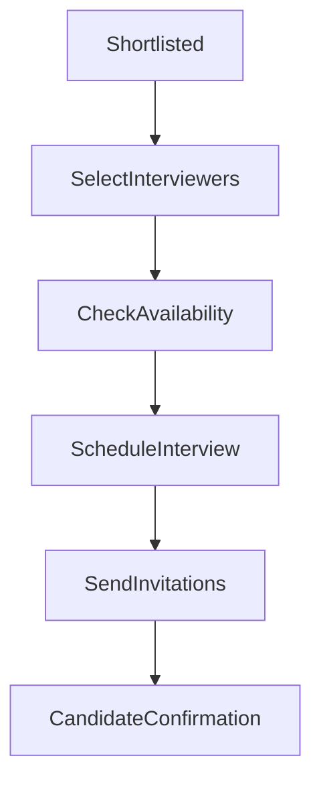

### System Actions

- Calendar invitation
- Email notification
- Reminder scheduling
- Audit logging

---

# 7. Interview Execution Workflow

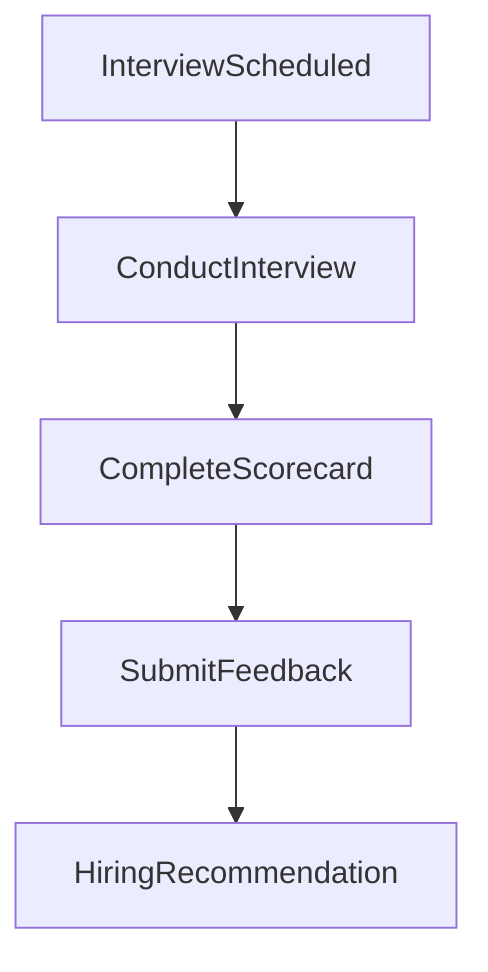

### Participants

- Candidate
- Interviewers
- Hiring Manager

---

# 8. Hiring Decision Workflow

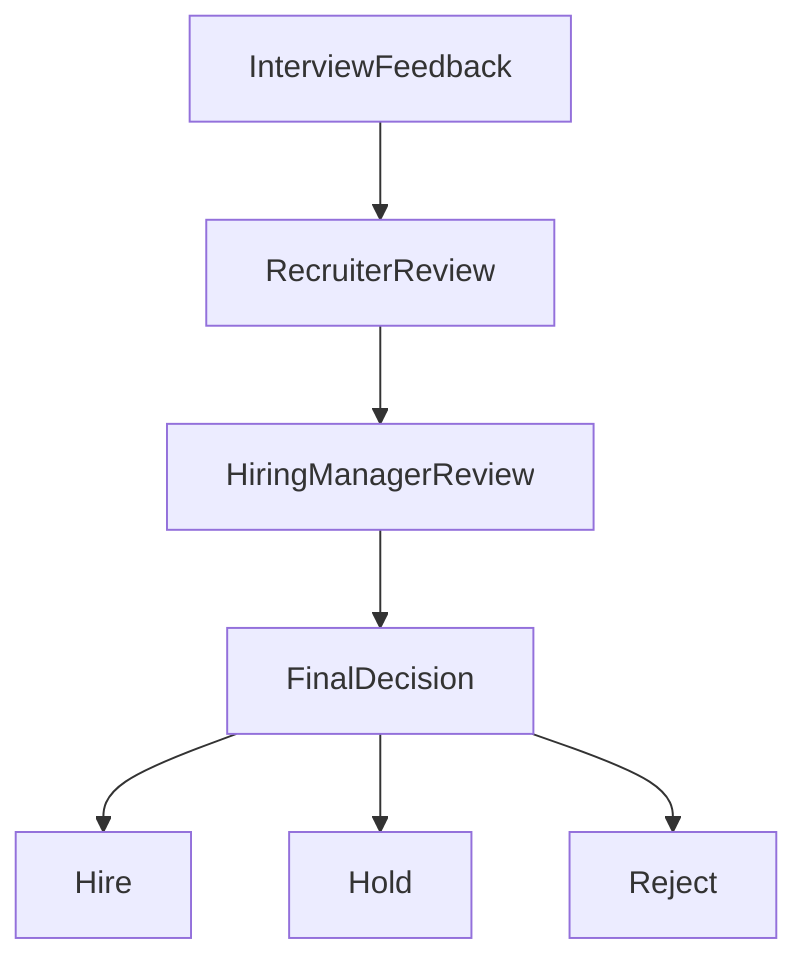

### Decision Criteria

- Technical score
- Behavioral evaluation
- Experience
- Budget
- Team fit

---

# 9. Offer Approval Workflow

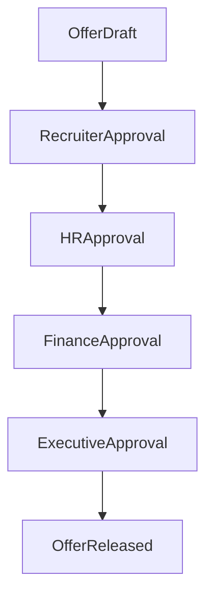

Organizations may configure approval levels based on internal policies.

---

# 10. Offer Acceptance Workflow

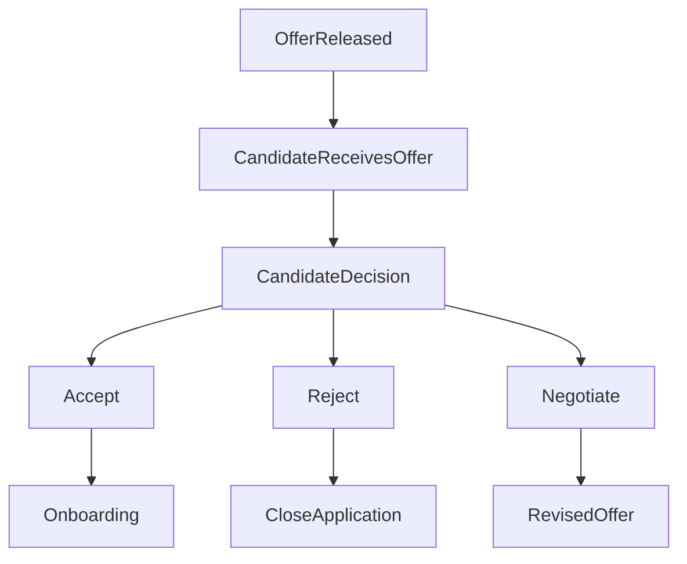

---

# 11. User Provisioning Workflow

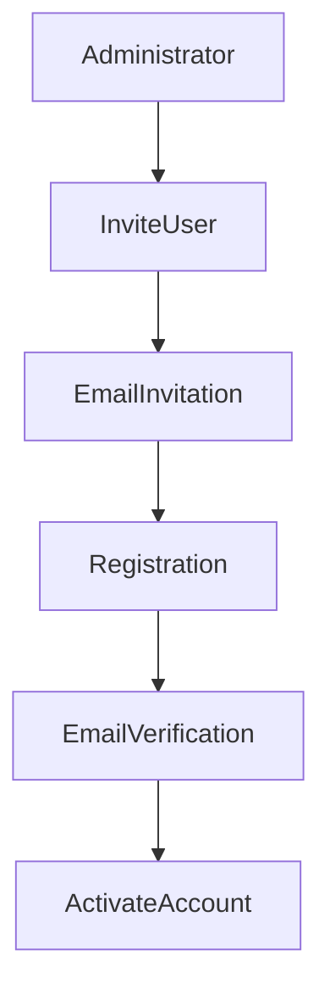

---

# 12. Authentication Workflow

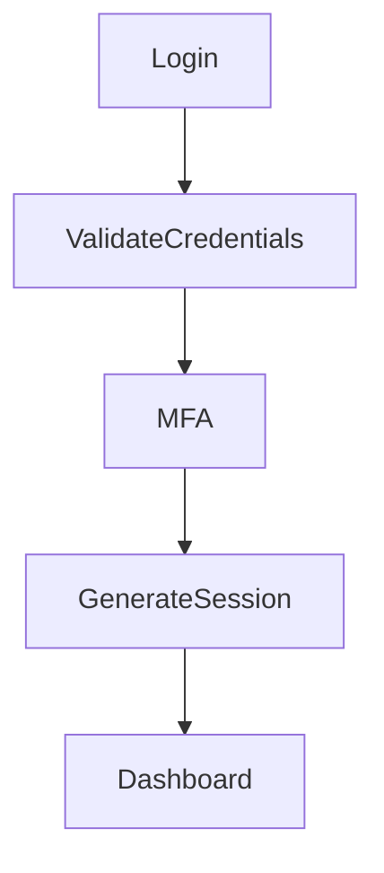

Failed authentication attempts shall be logged and handled according to organizational security policies.

---

# 13. Approval Workflow

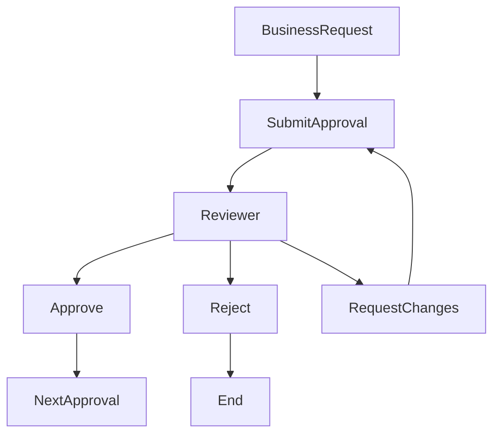

This workflow is reusable for jobs, offers, and administrative requests.

---

# 14. Notification Workflow

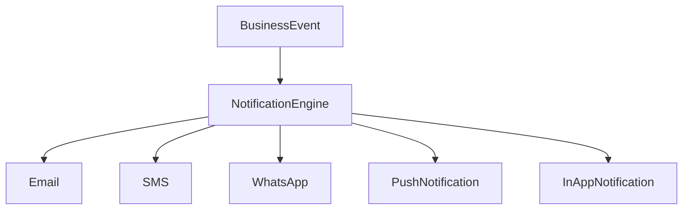

Supported business events include:

- Registration
- Job Published
- Application Submitted
- Interview Scheduled
- Offer Released
- Offer Accepted

---

# 15. Candidate Status Workflow

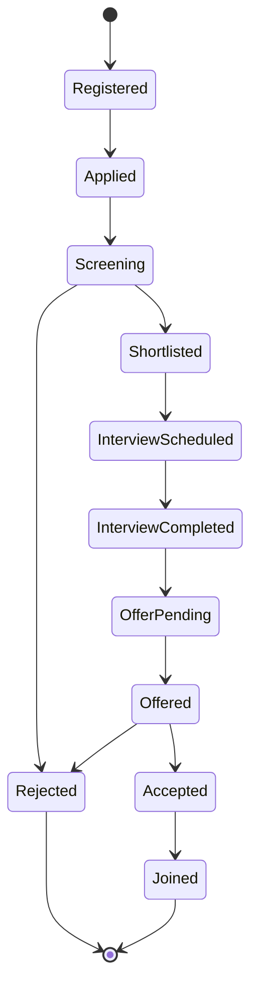

---

# 16. Job Lifecycle Workflow

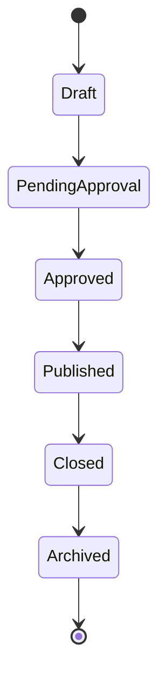

---

# 17. Offer Lifecycle Workflow

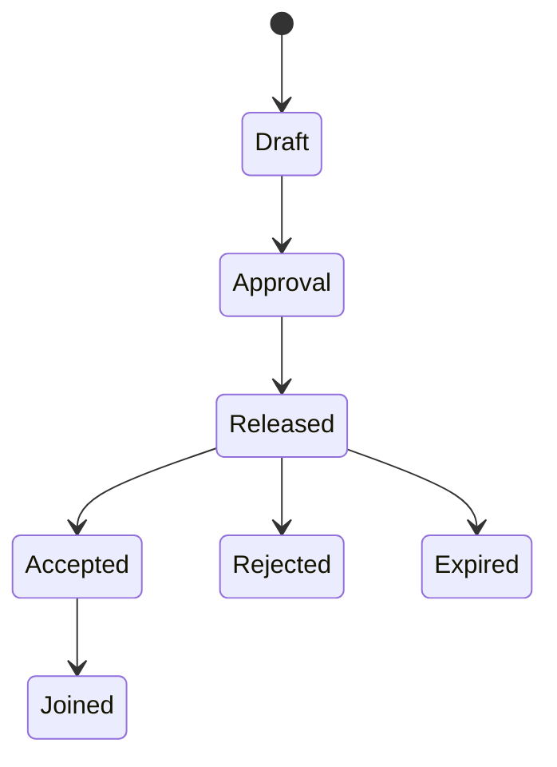

---

# 18. Workflow Exception Handling

The platform shall support exception handling for common scenarios:

| Scenario | Expected Action |
|----------|-----------------|
| Candidate Withdraws | Close application and notify recruiter |
| Interview Cancelled | Reschedule or close interview |
| Offer Expired | Update status and notify recruiter |
| Approval Rejected | Return workflow to previous stage |
| User Deactivated | Reassign ownership of active work |

---

# 19. Workflow Monitoring

The system shall provide visibility into workflow execution, including:

- Current workflow stage
- Pending approvals
- Bottlenecks
- Average processing time
- SLA breaches
- Escalations
- Historical workflow execution

---

# 20. Workflow Configuration

Organizations shall configure:

- Recruitment stages
- Approval levels
- Notification triggers
- Escalation rules
- SLA thresholds
- Workflow transitions
- Auto-approval conditions

Configuration changes shall not affect historical workflow executions.

---

# 21. Workflow Audit Requirements

Every workflow execution shall record:

- Workflow instance identifier
- Current stage
- Previous stage
- User performing action
- Timestamp
- Comments
- Approval decision
- Outcome

Workflow history shall be immutable and available for audit and reporting.

---

# 22. Summary

Business workflows define the operational processes that drive recruitment activities within KrewOps. From job creation through onboarding, each workflow ensures consistent execution, accountability, traceability, and collaboration across all stakeholders. By combining configurable workflows with comprehensive audit trails and automation, the platform enables organizations to standardize hiring practices while remaining flexible enough to support diverse business requirements.
